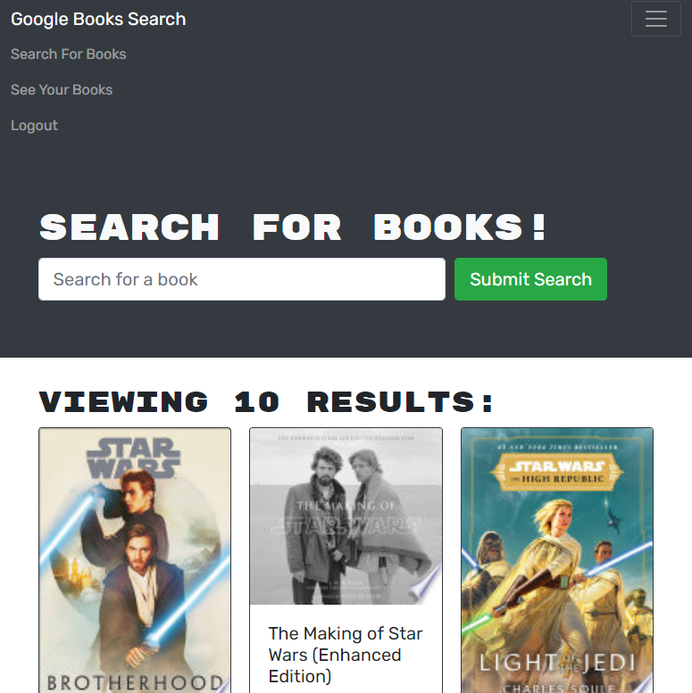

# Book Search Engine

[](https://opensource.org/licenses/MIT)

## **Description**
The purpose of this project was to take a fully functional Google Books API search engine built with a RESTful API and to refactor the code to be a GraphQL API built with an Apollo Server.

## **Deployed Link**
Click on the following link to be navigated to the application: https://damp-brook-89071.herokuapp.com/

## **Technologies**

* 
* 
* 
* 
* 

## **Installation**
First, you'll want to clone down this repository onto your local machine. You can do this by copying the code within the green code button towards the upper-righthand side of the screen and typing out `git clone *insert your copied code here*` within your command terminal.

Next, you'll want to type the following in the command line. This installs the dependencies that will be used. 
```
npm install
```

Next, you'll want to run the following in the command line.
```
npm run start
```

## **Application**
Here is how the application looks like:



## **License**
The following application is covered under the MIT License.